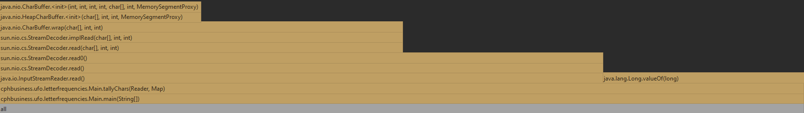
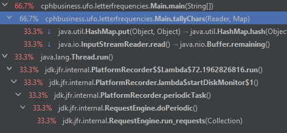
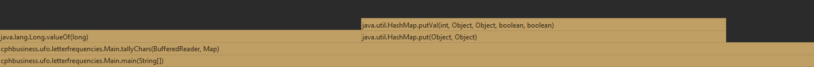
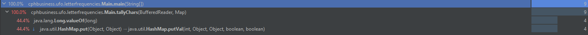

# Assignment-3-Optimization
- Jonatan Bakke https://github.com/JonatanMagnusBakke
- Jonas Hein - https://github.com/Zenzus
- Thomas Ebsen - https://github.com/Srax 
- [Assignment](/assignment.pdf)
- [Java Program](/letterfrequencies)
- [LaTeX Hand-in PDF](/LaTeX/main.pdf)

# Specs
### Specs of the machine used to perform the tests:
**CPU**: Intel(R) Core(TM) i5-7300HQ CPU @2.50GHz  
**Ram**: 8gb Single Channel 2400MHz  
**OS:** Windows 10 Home (OS Build 19041.867)

# Task 1
## Find a point in your program that can be optimized (for speed), for example by using a profiler.
We ran the `letterfrequencies` java program with a profiler which showed us that the `tallyChars` method is indeed one of the programs biggest bottlenecks.  





## Make a measurement of the point to optimize, for example by running a number of times, and calculating the mean and standard deviation (see the paper from Sestoft).  

We timed the execution of the program 10 times and found the average time it took for our pc to run the project.  

This is the times before optimization:  

```
Run 1: 152.073 ms
Run 2: 104.019 ms
Run 3: 66.9943 ms
Run 4: 88.3265 ms
Run 5: 64.8921 ms
Run 6: 52.9183 ms
Run 7: 53.6571 ms
Run 8: 53.3412 ms
Run 9: 96.7388 ms
Run 10: 87.2514 ms

Average (mean): 82.02123 ms
```  

After some research we found out that *"The new JDK 1.1 improves I/O performance with the addition of a collection of Reader and Writer classes. The readLine method in BufferedReader is at least 10 to 20 times faster than the one in DataInputStream when a large file is encountered.[[1]](https://www.infoworld.com/article/2077523/java-tip-26--how-to-improve-java-s-i-o-performance.html)"*  

So naturally we replaced the reader with a bufferedReader with a size of 10.000,  and got this result:  
  
Old reader:
```java
 Reader reader = new FileReader(fileName);
```  

New reader:
```java
BufferedReader reader = new BufferedReader(fileReader,10000);
```  

New result:




```
Run 1: 82.226 ms
Run 2: 34.3938 ms
Run 3: 58.0026 ms
Run 4: 40.7641 ms
Run 5: 30.4765 ms
Run 6: 39.6008 ms
Run 7: 41.5937 ms
Run 8: 42.4653 ms
Run 9: 52.4299 ms
Run 10: 39.8449 ms

Average (mean): 46.17976 ms
```

As you can see, small changes to the code can result in HUGE improvements to the execution times, which further reinforces our statement, that it is important to research the functions you're going to use before writing the program.  

#### End result
**Standard Deviation**, σ: 14.181848046443  
**Count, N:**&nbsp;&nbsp;&nbsp;&nbsp;&nbsp;&nbsp;&nbsp;&nbsp;&nbsp;&nbsp;10  
**Sum, Σx:**&nbsp;&nbsp;&nbsp;&nbsp;&nbsp;&nbsp;&nbsp;&nbsp;&nbsp;&nbsp;&nbsp;&nbsp;461.7976  
**Mean, μ:**&nbsp;&nbsp;&nbsp;&nbsp;&nbsp;&nbsp;&nbsp;&nbsp;&nbsp;&nbsp;&nbsp;&nbsp;46.17976  
**Variance, σ2:**&nbsp;&nbsp;&nbsp;&nbsp;&nbsp;201.1248140124
